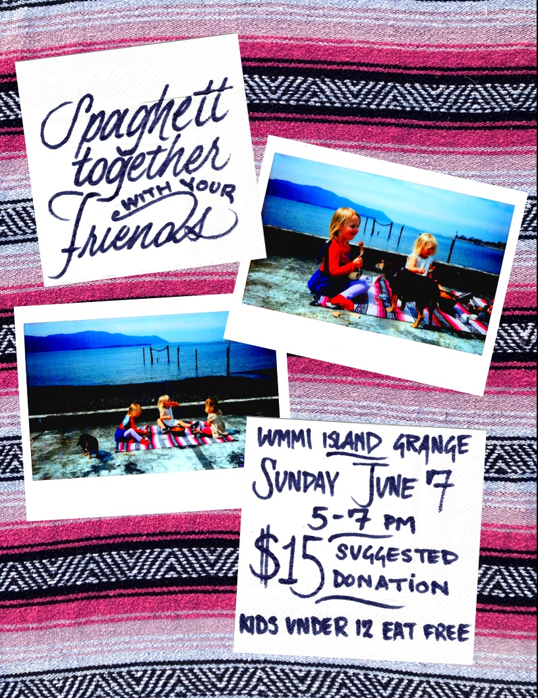

The Spaghett-Together is a monthly feast hosted at the Lummi Island Grange.

## upcoming ghett-togethers

### <time>June 7, 2026</time>

<time>June 7, 2026</time> at the <b>Lummi Island Grange</b> from <time>5pm</time> - <time>7pm</time>.

Suggested $15 donation per person, and kids under 12 eat free.

### <time>July 5, 2026</time>

past ghett-togethers

### <time>May 3, 2026</time>

<time>May 3, 2026</time> at the <b>Lummi Island Grange</b> from <time>5pm</time> - <time>7pm</time>.

Suggested $15 donation per person.

